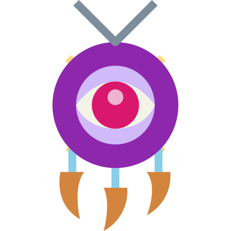

  

    

<h1 align="center">GrimoireTalisman</h1>

Why Talisman?

* **Safety**

    Safely and correctly catching exceptions is _not hard_, but surely annoying to deal with.
    Introducing `Seal`. `Seal` is designed in a very much same way as `kotlin.Result` except you
    can return it from methods, works regardless of Kotlin version and doesn't require any command
    line flags.

* **Separation of concerns**

    You can try as much as you'd like, however rule of having your classes do one thing and one
    thing only is tempting to break. By using `UseCase` you're no longer tempted by that bad habit.
    As the name implies it's just a use-case, one input - one output. That's it.

* **Extendability**

    All existing APIs in Talisman are designed to be extensible. No more "oh my gawd, I need to use
    this variable but it's internal". Extend existing APIs, submit pull requests. Easy.

* **Reusability**

    Having separated concerns this is already easy but needs to be mentioned. Every bit of code,
    every use-case can be reused everywhere in your app, significantly cutting down on the amount of
    copy pasted code.

Logo by <a href="https://www.flaticon.com/authors/smalllikeart" title="smalllikeart">smalllikeart</a>
